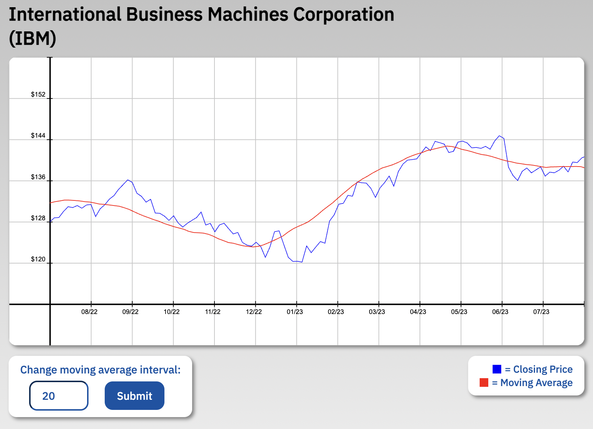

# Moving Average Chart Generator
## Description
This application renders financial information onto a graph and calculates a moving average based on the stock price input. A moving average is a statistic that captures the average change in a data series over time. Users may alter the time interval that determines the moving average and compare the result against the closing price curve.

While in development, this app uses static data from an API that I set up based on Yahoo Finance's publicly available information for IBM. Project links below:

[GitHub Link](https://github.com/RonLanzilotta/charIQ_technical)<br>
[Deployed API](https://chartiq-api-8511c706644d.herokuapp.com/api/data)<br>
[Data Source](https://finance.yahoo.com/quote/IBM/chart?p=IBM&nn=1#eyJsYXlvdXQiOnsiaW50ZXJ2YWwiOjEsInBlcmlvZGljaXR5IjoxLCJ0aW1lVW5pdCI6Im1pbnV0ZSIsImNhbmRsZVdpZHRoIjoxLCJmbGlwcGVkIjpmYWxzZSwidm9sdW1lVW5kZXJsYXkiOnRydWUsImFkaiI6dHJ1ZSwiY3Jvc3NoYWlyIjp0cnVlLCJjaGFydFR5cGUiOiJtb3VudGFpbl9iYXNlbGluZV9kZWx0YSIsImV4dGVuZGVkIjpmYWxzZSwibWFya2V0U2Vzc2lvbnMiOnt9LCJhZ2dyZWdhdGlvblR5cGUiOiJvaGxjIiwiY2hhcnRTY2FsZSI6ImxpbmVhciIsInBhbmVscyI6eyJjaGFydCI6eyJwZXJjZW50IjoxLCJkaXNwbGF5IjoiSUJNIiwiY2hhcnROYW1lIjoiY2hhcnQiLCJpbmRleCI6MCwieUF4aXMiOnsibmFtZSI6ImNoYXJ0IiwicG9zaXRpb24iOm51bGx9LCJ5YXhpc0xIUyI6W10sInlheGlzUkhTIjpbImNoYXJ0Iiwi4oCMdm9sIHVuZHLigIwiXX19LCJzZXRTcGFuIjpudWxsLCJvdXRsaWVycyI6ZmFsc2UsImFuaW1hdGlvbiI6dHJ1ZSwiaGVhZHNVcCI6eyJzdGF0aWMiOnRydWUsImR5bmFtaWMiOmZhbHNlLCJmbG9hdGluZyI6ZmFsc2V9LCJsaW5lV2lkdGgiOjIsImZ1bGxTY3JlZW4iOnRydWUsInN0cmlwZWRCYWNrZ3JvdW5kIjp0cnVlLCJjb2xvciI6IiMwMDgxZjIiLCJyYW5nZSI6bnVsbCwic3ltYm9scyI6W3sic3ltYm9sIjoiSUJNIiwic3ltYm9sT2JqZWN0Ijp7InN5bWJvbCI6IklCTSIsInF1b3RlVHlwZSI6IkVRVUlUWSIsImV4Y2hhbmdlVGltZVpvbmUiOiJBbWVyaWNhL05ld19Zb3JrIiwibWFya2V0IjoidXNfbWFya2V0In0sInBlcmlvZGljaXR5IjoxLCJpbnRlcnZhbCI6MSwidGltZVVuaXQiOiJtaW51dGUiLCJzZXRTcGFuIjpudWxsfV0sInJlbmtvIjpudWxsLCJrYWdpIjpudWxsLCJzdHVkaWVzIjp7IuKAjHZvbCB1bmRy4oCMIjp7InR5cGUiOiJ2b2wgdW5kciIsImlucHV0cyI6eyJpZCI6IuKAjHZvbCB1bmRy4oCMIiwiZGlzcGxheSI6IuKAjHZvbCB1bmRy4oCMIn0sIm91dHB1dHMiOnsiVXAgVm9sdW1lIjoiIzBkYmQ2ZWVlIiwiRG93biBWb2x1bWUiOiIjZmY1NTQ3ZWUifSwicGFuZWwiOiJjaGFydCIsInBhcmFtZXRlcnMiOnsiY2hhcnROYW1lIjoiY2hhcnQiLCJlZGl0TW9kZSI6dHJ1ZX0sImRpc2FibGVkIjpmYWxzZX19fSwiZXZlbnRzIjp7ImRpdnMiOnRydWUsInNwbGl0cyI6dHJ1ZSwidHJhZGluZ0hvcml6b24iOiJub25lIiwic2lnRGV2RXZlbnRzIjpbXX0sInByZWZlcmVuY2VzIjp7ImN1cnJlbnRQcmljZUxpbmUiOnRydWUsImRyYWdnaW5nIjp7InNlcmllcyI6dHJ1ZSwic3R1ZHkiOnRydWUsInlheGlzIjp0cnVlfSwiZHJhd2luZ3MiOm51bGwsImhpZ2hsaWdodHNSYWRpdXMiOjEwLCJoaWdobGlnaHRzVGFwUmFkaXVzIjozMCwibWFnbmV0IjpmYWxzZSwiaG9yaXpvbnRhbENyb3NzaGFpckZpZWxkIjpudWxsLCJsYWJlbHMiOnRydWUsImxhbmd1YWdlIjpudWxsLCJ0aW1lWm9uZSI6bnVsbCwid2hpdGVzcGFjZSI6NTAsInpvb21JblNwZWVkIjpudWxsLCJ6b29tT3V0U3BlZWQiOm51bGwsInpvb21BdEN1cnJlbnRNb3VzZVBvc2l0aW9uIjpmYWxzZX19)
<br>


## Launching the Project
Fork and clone this public repository and open it in an IDE of your choice. Launch a server on your local device to view the landing page displayed in the image above.

## Technical Notes

This project's frontend was built using **vanilla JavaScript, CSS,** and relied heavily on **HTML5 Canvas** elements. The backend was built using **JavaScript, node.js, express.js, and deployed using Heroku.**

First, the daily IBM stock data was downloaded from Yahoo Finance as a .csv file, converted to JSON, and then injected as static data into the API. Below is a snippet of the **fetchStockData()** function which maps through the raw data and returns an array of objects that have date and price keys with corresponding values.

```
const stockPrices = Object.entries(stockData).map(([date, values]) => {
    return { date, price: parseFloat(values['Close']) };
})
```
Next, we'll look at the **drawChart()** function which is where most of the action happens. I've broken it down into its five main parts below: <br>
- Optimize canvas pixel resolution and initialize chart dimensions.
```
const dpr = window.devicePixelRatio || 1;
const chart = document.getElementById("lineChart");
const ctx = chart.getContext("2d");

const chartWidth = chart.clientWidth * dpr;
const chartHeight = chart.clientHeight * dpr;
chart.width = chartWidth;
chart.height = chartHeight;

chart.style.width = `${chartWidth / dpr}px`;
chart.style.height = `${chartHeight / dpr}px`;

ctx.scale(dpr, dpr);
```
- Create dynamic labels for Y-axis.
```
let yAxisUpperBound = 0;
    let yAxisLowerBound = Infinity;
    let yAxisLabelArr = [];

for (let i = 0; i < prices.length; i++) {
    if (prices[i] > yAxisUpperBound) {
        yAxisUpperBound = Math.round(prices[i] / 10) * 10;
    }
    if (prices[i] < yAxisLowerBound && prices[i] > 0) {
        yAxisLowerBound = Math.round(prices[i] / 10) * 10;
    }
}

let yAxisInterval = Math.round((yAxisUpperBound - yAxisLowerBound) / 4);

for (let i = 0; i < 5; i++) {
    yAxisLabelArr.push(yAxisLowerBound + (i * yAxisInterval));
}
```
- Calculate moving average interval.
```
const movingAverages = [];

for (let i = movingAverageInterval - 1; i < prices.length; i++) {
    const sum = prices.slice(i - movingAverageInterval + 1, i + 1).reduce((acc, val) => acc + val, 0);

    movingAverages.push(sum / movingAverageInterval);
}
```
- Draw grid lines, tick marks, and axis labels using HTML5 Canvas.
```
for (i = 0; i < linesX; i++) {
    ctx.beginPath();
    ctx.lineWidth = 1;
    ctx.strokeStyle = "#000000";
    ctx.moveTo(-4, -gridQuadrantSize * i + 0.5);
    ctx.lineTo(4, -gridQuadrantSize * i + 0.5);
    ctx.stroke();

    ctx.font = '9px Arial';
    ctx.textAlign = 'center';
    yAxisLabelArr[i] === '' ? 
        ctx.fillText(yAxisLabelArr[i], -16, -gridQuadrantSize * i - 2) :
        ctx.fillText(`$${yAxisLabelArr[i]}`, -16, -gridQuadrantSize * i - 2);
}
```
- Draw stock price and moving average curves using HTML5 Canvas.
```
    ctx.beginPath();
    ctx.strokeStyle = 'red';
    ctx.lineWidth = 1;
    ctx.moveTo(0, chartHeight + adjustHeight - (movingAverages[0] * chartHeight / maxPrice));

    for (let i = 1; i < movingAverages.length; i++) {
        ctx.lineTo(i * chartWidth / (movingAverages.length - 1), chartHeight + adjustHeight - (movingAverages[i] * chartHeight / maxPrice));
    }
    ctx.stroke();
```
## Future Features
Given the short timeframe for this project, there is much that could be improved upon. Large chunks of the code should be modularized into smaller functions which are called within the **drawChart()** function. Below are some future features that I plan to build out in the coming weeks:

- Dynamic and more accurate renderings of the graph lines and their relation to the X- and Y-axis tick marks.
- A more responsive design.
- Avoid re-rendering the entire graph on user input. Break out the portion of drawChart() which handles drawing the moving average graph line.
- Use more dynamic parameters in the algorithm that generates Y-axis labels.
- Create dynamic X-axis date labels.
- Offer a toggle between different stock statistic options based on OHLC data.
- Hover over graph line and reveal a sliding thumbnail which displays the stock price.
- Light and dark mode themes.

